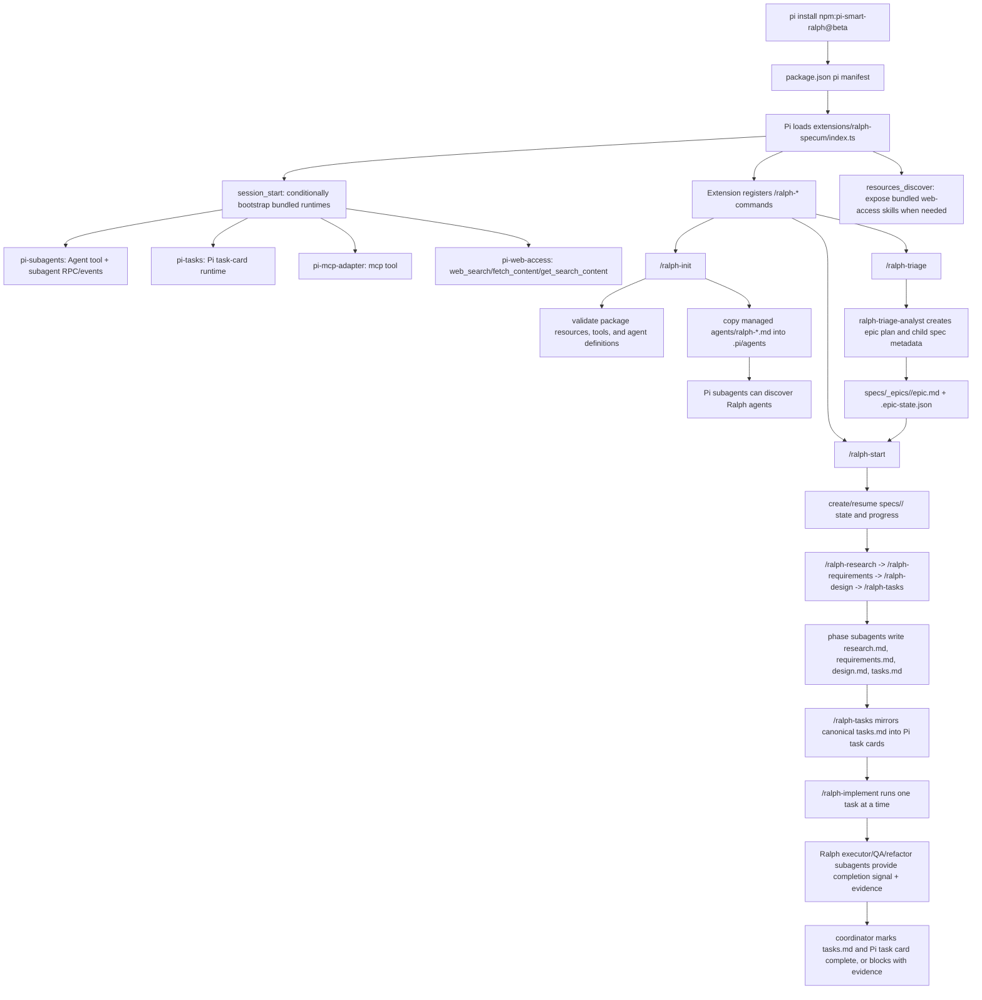

# Pi Smart Ralph

**Pi Smart Ralph** is a Pi-only extension for structured, spec-driven software development with autonomous subagents, task tracking, epic decomposition, verification gates, and optional GitHub issue output.

Install it into any Pi project with:

```bash
pi install npm:pi-smart-ralph@beta
```

Then run inside Pi:

```text
/ralph-init
/ralph-help
```

---

## Disclaimer and credits

This project is an independent Pi-native package inspired by the original Smart Ralph workflow.

Credit to the original Smart Ralph project and author:

- Original repository: <https://github.com/tzachbon/smart-ralph>
- Original author/repository owner: `tzachbon`

This repository is maintained separately for the Pi agent ecosystem and is intended to be used **only with Pi**.

---

## What it does

Pi Smart Ralph adds a full `/ralph-*` workflow to Pi:

1. Turn a rough goal into a tracked spec.
2. Generate research, requirements, design, and task artifacts.
3. Mirror `tasks.md` into Pi task cards.
4. Execute tasks through focused Pi subagents.
5. Require real verification evidence before marking work complete.
6. Decompose larger initiatives into epics and child specs.
7. Optionally create or update GitHub issues from epic triage.

The goal is to make AI-assisted development more auditable and less ad hoc: every implementation should have context, acceptance criteria, task boundaries, verification proof, and resumable state.

---

## How the Pi extension works

Pi Smart Ralph is modeled after the original Smart Ralph flow, but it is implemented as a **Pi package and Pi extension**, not as a Claude Code plugin, Codex skill bundle, or stop-hook loop.

At a high level:



### 1. Pi package loading

`package.json` declares Pi resources under the `pi` key:

```json
{
  "pi": {
    "extensions": ["./extensions/ralph-specum/index.ts"],
    "skills": ["./skills"],
    "prompts": ["./prompts"]
  }
}
```

When Pi loads the package, it imports `extensions/ralph-specum/index.ts`. The extension factory subscribes to Pi lifecycle events and registers the `/ralph-*` slash commands. The commands are extension commands, so they run directly inside Pi command handlers rather than being expanded from prompt text.

### 2. Runtime bootstrap

On `session_start`, Smart Ralph checks the active Pi tool registry. If the required runtime tools already exist and are active, it uses them. If tools are missing, it conditionally imports bundled runtime package entrypoints from this package's `node_modules`:

- `@tintinweb/pi-subagents` for `Agent` and the subagent RPC/event runtime
- `@tintinweb/pi-tasks` for Pi task-card support
- `pi-mcp-adapter` for `mcp`
- `pi-web-access` for `web_search`, `fetch_content`, and `get_search_content`

If a tool provider is registered but inactive, Smart Ralph does **not** load a duplicate provider. `/ralph-init` reports that the tool needs to be enabled.

The extension also handles `resources_discover`. When the bundled `pi-web-access` runtime was loaded by Smart Ralph, its bundled skills directory is exposed to Pi for that session.

### 3. Project bootstrap and Ralph agents

`/ralph-init` validates the package and target project without starting a spec. It checks package resources, required runtime packages, required active tools, runtime defaults, and Ralph agent frontmatter.

It also writes missing Smart Ralph defaults into `.pi/subagents.json` and `.pi/tasks-config.json` while preserving any existing user-set keys. These defaults keep Ralph subagents visible in the background widget, disable FleetView and scheduled-agent prompt overhead, and make Pi task cards session-scoped with completed tasks retained for evidence. If defaults are added or files are created, run `/reload` or restart Pi so the bundled runtimes reload their startup settings.

It also copies the bundled Ralph agent definitions from this package's `agents/` directory into the target project's `.pi/agents/` directory. Existing Smart-Ralph-managed files can be updated automatically. User-owned conflicting `ralph-*.md` files are not overwritten unless you run:

```text
/ralph-init --refresh-agents
```

Those project-local `.pi/agents/ralph-*.md` files are what Pi subagent discovery uses during Ralph phase and implementation runs.

### 4. Normal spec flow

`/ralph-start <spec> <goal>` creates or resumes a spec under the configured spec root, normally `specs/<spec>/`. `/ralph-new <spec> <goal>` is a compatibility alias that follows the same start path and writes equivalent state except for explicit command/alias metadata. Start/new writes or updates:

```text
specs/<spec>/
  .progress.md
  .ralph-state.json
```

It also updates the active spec marker:

```text
specs/.current-spec
```

The normal phase sequence is:

```text
/ralph-research      -> ralph-research-analyst      -> research.md
/ralph-requirements  -> ralph-product-manager       -> requirements.md
/ralph-design        -> ralph-architect-reviewer    -> design.md
/ralph-tasks         -> ralph-task-planner          -> tasks.md
/ralph-implement     -> executor/QA/refactor agents -> checked-off tasks
```

Each phase command waits for Pi to be idle, validates prerequisites, builds a focused prompt from the current spec state and upstream artifacts, then spawns the relevant Ralph subagent through Pi subagent RPC/events. After the subagent returns, the coordinator validates the expected artifact shape before advancing state.

Outside quick/autonomous mode, phase commands create an approval boundary in Pi UI before moving to the next phase.

### 5. Quick/autonomous flow

`/ralph-start --quick ...`, `/ralph-new --quick ...`, `/ralph-start --autonomous ...`, and `/ralph-new --autonomous ...` skip manual approval boundaries, but they do not skip validation. Before writing new spec files, start/new records a branch/worktree decision. In quick or autonomous mode, default-branch checkouts use a deterministic safe `ralph/<spec-name>` current-directory branch decision, while non-default branch checkouts stay on the current branch. These headless defaults do not prompt and do not use destructive git actions such as forced switches, resets, branch deletion, or discard operations.

The coordinator:

1. generates each artifact,
2. runs `ralph-spec-reviewer` against it,
3. retries reviewable artifact failures up to the configured review limit,
4. mirrors `tasks.md` to Pi task cards, then
5. enters `/ralph-implement`.

If a validation or review step cannot pass, the quick flow records the blocker in `.progress.md` and `.ralph-state.json` instead of silently continuing.

### 6. Task execution loop

`tasks.md` remains the canonical implementation plan. `/ralph-tasks` parses checkbox tasks and mirrors them into the Pi task-card store for visibility and status tracking.

`/ralph-implement` repeatedly selects the next incomplete task whose dependencies are complete. For each task it:

1. marks the mirrored Pi task card `in_progress`,
2. chooses the implementation agent:
   - `ralph-spec-executor` for normal implementation tasks,
   - `ralph-qa-engineer` for `[VERIFY]` or QA tasks,
   - `ralph-refactor-specialist` for refactor/spec-update tasks,
3. runs exactly that task through Pi subagent RPC/events,
4. requires the expected completion signal plus meaningful verification evidence,
5. checks off the task in `tasks.md`,
6. marks the Pi task card `completed`, and
7. appends evidence to `.progress.md` and `.ralph-state.json`.

If the subagent output is missing the required signal, includes a contradiction such as `USER_INPUT_REQUIRED` or `VERIFICATION_FAIL`, or lacks verification evidence, the coordinator leaves the task incomplete and records a blocker.

### 7. Epic flow

`/ralph-triage <epic> <goal>` uses `ralph-triage-analyst` to decompose large work into a dependency-aware epic. Depending on `--output`, the coordinator can write spec files, create/update GitHub issues after confirmation, or both.

Epic state is stored under:

```text
specs/_epics/<epic>/
  epic.md
  .epic-state.json
```

Child specs are then selected with `/ralph-start --next-epic-spec` or `/ralph-epic-next --start`. During implementation, Ralph updates the epic state as child specs move from pending to in-progress to completed.

---

## Current status

This package is currently in beta.

Recommended install:

```bash
pi install npm:pi-smart-ralph@beta
```

The package name is:

```text
pi-smart-ralph
```

Npm package metadata should point to this repository:

```text
https://github.com/Nephylem/pi-smart-ralph
```

---

## Requirements

- Node.js and npm
- Pi coding agent installed as `pi`
- A target project, preferably a git repository
- Optional for GitHub issue sync:
  - GitHub CLI: `gh`
  - authenticated `gh auth status`
  - a GitHub remote on the target repository

Pi Smart Ralph bundles and conditionally loads the runtime packages it needs:

- `@tintinweb/pi-subagents`
- `@tintinweb/pi-tasks`
- `pi-mcp-adapter`
- `pi-web-access`

If those tools are already installed and active in your Pi environment, Smart Ralph uses the existing tools instead of loading duplicate bundled copies.

---

## Model provider support

Ralph agents now inherit the active Pi model instead of pinning a provider-specific model in their agent frontmatter.

That means Ralph works with the Pi provider you authenticated and selected, including the three common Pi login providers:

- `anthropic`
- `openai-codex`
- `github-copilot`

Use Pi's built-in model selector whenever you want full control:

```text
/model
```

Or use Ralph's helper command:

```text
/ralph-model
/ralph-model auto
/ralph-model anthropic
/ralph-model openai-codex
/ralph-model github-copilot
/ralph-model <provider>/<model-id>
```

`/ralph-model auto` selects the recommended available model for the current supported provider, or for the only supported provider you have authenticated. After switching, Ralph subagents inherit that active Pi model.

If you previously bootstrapped older Ralph agents that still contain `model:` frontmatter, refresh them:

```text
/ralph-init --refresh-agents
```

---

## Installation

From the project where you want to use Ralph:

```bash
pi install npm:pi-smart-ralph@beta
```

Start Pi:

```bash
pi --approve
```

Inside Pi:

```text
/ralph-init
```

`/ralph-init` validates package resources, required Pi tools, bundled runtime bootstrap, and Ralph subagent discovery.

If everything is healthy, you should see:

```text
Smart Ralph bootstrap validation passed.
```

---

## Updating

Update the installed Pi package:

```bash
pi update npm:pi-smart-ralph
```

Then restart Pi or run:

```text
/reload
```

Check the commands:

```text
/ralph-help
/ralph-init
```

---

## Quick start

Create a new spec from a goal:

```text
/ralph-start add-email-login Add passwordless email login with rate limiting and tests
```

`/ralph-new` is available as a compatibility command for existing Smart Ralph habits. It uses the same parser and start flow as `/ralph-start`, including supported flags such as `--skip-research`, `--specs-dir`, `--tasks-size`, `--commit-spec`, and `--no-commit-spec`; the only intentional difference is alias metadata recorded for downstream Ralph state consumers.

Run the normal spec phases:

```text
/ralph-research
/ralph-requirements
/ralph-design
/ralph-tasks
/ralph-implement
```

For a small smoke test:

```text
/ralph-start --quick smoke-test Create a smoke.txt file containing "pi smart ralph works" and verify it exists.
```

---

## Command overview

### Bootstrap

| Command | Description |
| --- | --- |
| `/ralph-help` | Show command help. |
| `/ralph-init` | Validate the package, write missing runtime defaults, and bootstrap project-local Ralph agents. |
| `/ralph-init --refresh-agents` | Re-copy bundled Ralph agents into `.pi/agents`, replacing conflicts intentionally. |
| `/ralph-init --no-runtime-config` | Validate/bootstrap without writing `.pi/subagents.json` or `.pi/tasks-config.json`. |
| `/ralph-model [auto\|provider\|model]` | Show or switch the active Pi model that Ralph subagents inherit. |

### Spec workflow

| Command | Description |
| --- | --- |
| `/ralph-start <spec> <goal>` | Create or resume a spec and set it active. |
| `/ralph-new <spec> <goal>` | Compatibility alias for `/ralph-start` with the same options and state behavior, plus alias metadata. |
| `/ralph-start --quick <spec> <goal>` | Start a quick flow that minimizes approval pauses. |
| `/ralph-start --autonomous <spec> <goal>` | Start an autonomous-style quick flow. |
| `/ralph-new --quick <spec> <goal>` | Run the same quick start flow through the compatibility command. |
| `/ralph-research [spec]` | Generate `research.md`. |
| `/ralph-requirements [spec]` | Generate `requirements.md`. |
| `/ralph-design [spec]` | Generate `design.md`. |
| `/ralph-tasks [spec]` | Generate `tasks.md` and mirror tasks into Pi task cards. |
| `/ralph-implement [spec]` | Execute open tasks through Ralph subagents. |
| `/ralph-status` | Show known specs and progress. |
| `/ralph-switch <spec-or-path>` | Switch the active spec. |
| `/ralph-cancel [spec-or-path]` | Clear active Ralph execution state for a spec. |

### Epic workflow

| Command | Description |
| --- | --- |
| `/ralph-triage <epic> <goal>` | Decompose a large goal into a dependency-aware epic. |
| `/ralph-triage --fresh <epic> <goal>` | Regenerate an epic plan from scratch. |
| `/ralph-triage --output spec-files <epic> <goal>` | Write epic and child spec files only. |
| `/ralph-triage --output github-issues <epic> <goal>` | Create/update GitHub issues after confirmation. |
| `/ralph-triage --output both <epic> <goal>` | Write spec files and sync GitHub issues. |
| `/ralph-triage --output both --yes <epic> <goal>` | Confirm GitHub writes for approved/noninteractive runs. |
| `/ralph-epic-status [epic]` | Show child-spec readiness and blockers. |
| `/ralph-epic-status --json [epic]` | Print normalized epic state. |
| `/ralph-epic-status --repair [epic]` | Repair missing child stubs and stale active-spec metadata. |
| `/ralph-epic-switch <epic>` | Switch the active epic. |
| `/ralph-epic-next [--switch\|--start] [epic]` | Select the next unblocked child spec. |
| `/ralph-epic-cancel [epic]` | Cancel active epic execution state safely. |
| `/ralph-start --next-epic-spec` | Begin the next unblocked child spec from the active epic. |

---

## Generated files

Smart Ralph stores spec artifacts in your target project.

Typical spec:

```text
specs/<spec-name>/
  research.md
  requirements.md
  design.md
  tasks.md
  .progress.md
  .ralph-state.json
```

Typical epic:

```text
specs/_epics/<epic-name>/
  epic.md
  .epic-state.json
```

Project markers:

```text
specs/.current-spec
specs/.current-epic
```

Start/new also maintains repository-local `.gitignore` entries for Ralph runtime state. The updater is idempotent: it creates `.gitignore` if needed, appends only missing Ralph patterns, and preserves existing unrelated entries in their current order.

Required Ralph runtime ignore patterns:

```text
specs/.current-spec
specs/.current-epic
**/.progress.md
**/.ralph-state.json
```

Ralph agent definitions copied into the target project:

```text
.pi/agents/ralph-*.md
```

Pi task runtime files may be created under:

```text
.pi/tasks/
```

You usually should not commit runtime state such as `.pi/tasks/`, `.pi/output/`, `.pi/subagent-schedules/`, or `.pi/agent-memory-local/`.

---

## Included Ralph agents

Pi Smart Ralph includes these subagent definitions:

| Agent | Purpose |
| --- | --- |
| `ralph-research-analyst` | Researches external sources and project internals before conclusions. |
| `ralph-product-manager` | Converts goals into testable requirements. |
| `ralph-architect-reviewer` | Produces maintainable technical designs. |
| `ralph-task-planner` | Writes executable `tasks.md` plans with verification gates. |
| `ralph-spec-executor` | Implements one task and reports completion evidence. |
| `ralph-qa-engineer` | Runs verification tasks and reports pass/fail signals. |
| `ralph-refactor-specialist` | Updates specs and follow-up artifacts after implementation. |
| `ralph-spec-reviewer` | Reviews artifacts with read-only rubric checks. |
| `ralph-triage-analyst` | Decomposes large goals into epics and child specs. |

The package ships these files in `agents/`. Because Pi subagents discover project-local custom agents from `.pi/agents`, `/ralph-init` copies them into the target project.

After running `/ralph-init`, they should be visible in Pi’s `/agents` menu.

---

## How Pi tasks are used

`/ralph-tasks` keeps `tasks.md` as the canonical plan, then mirrors checkbox tasks into Pi task cards.

During `/ralph-implement`, Ralph updates the mirrored task cards as work moves through:

```text
pending -> in_progress -> completed
```

Task cards are used for visibility, dependency tracking, and execution status. The markdown file remains the source of truth for the implementation plan.

---

## How Pi subagents are used

Ralph phase commands and implementation loops run specialized subagents through Pi subagent orchestration.

Examples:

- `/ralph-research` delegates to `ralph-research-analyst`
- `/ralph-tasks` delegates to `ralph-task-planner`
- `/ralph-implement` delegates individual tasks to `ralph-spec-executor`, `ralph-qa-engineer`, or `ralph-refactor-specialist`
- `/ralph-triage` delegates epic planning to `ralph-triage-analyst`

Smart Ralph uses Pi subagent runtime events/RPC internally, so subagent runs may not always look like manual `Agent(...)` tool calls in the transcript.

---

## GitHub issue output

Epic triage can create or update GitHub issues.

Example:

```text
/ralph-triage --output both onboarding Build a complete onboarding flow with analytics and admin visibility
```

For safety, actual GitHub writes require either:

- confirmation in the Pi UI, or
- explicit `--yes`

Example:

```text
/ralph-triage --output github-issues --yes onboarding Build onboarding tracking
```

Before using GitHub output, confirm:

```bash
gh auth status
git remote -v
```

---

## Package layout

This repository is laid out as a Pi package:

```text
agents/                                      Ralph subagent definitions
extensions/ralph-specum/                     Pi extension source
prompts/                                     Pi prompt resources
references/                                  Workflow reference resources
references/ralph-resource-manifest.v1.json   Resource parity manifest
schemas/                                     Packaged compatibility schemas
skills/                                      Pi skill resources
templates/                                   Spec template resources
scripts/                                     Packaging verification scripts
package.json                                 Npm and Pi package manifest
README.md                                    Project documentation
```

Packaged resources are tracked by `references/ralph-resource-manifest.v1.json`. Each manifest entry maps an original Ralph Specum resource to its Pi package path and uses one status:

- `copied`: byte-identical package resource.
- `adapted`: intentionally changed for Pi.
- `renamed`: byte-identical content moved to a Pi package-safe path.
- `pi-native`: Pi-specific replacement for original workflow behavior.
- `excluded`: intentionally not packaged.
- `deferred`: intentionally left for a later parity spec.

Pi commands remain implemented in `extensions/ralph-specum/index.ts`; original command and hook files are packaged only as non-executable reference material and are not installed as executable Claude/Codex hooks. They also are not registered as Pi command handlers. Archived original command markdown lives under `references/original-commands/`, and `references/ralph-resource-manifest.v1.json` records whether each original command, hook-adjacent resource, template, reference, skill, or schema was copied, adapted, renamed, replaced with Pi-native behavior, excluded, or deferred.

Before publishing or changing packaged resources, run:

```bash
npm run prepack
npm run verify:pack
npm pack --dry-run --json
```

Use `npm run prepack` for repository resource and manifest checks, `npm run verify:pack` for the machine-readable package boundary verifier, and `npm pack --dry-run --json` when you need to inspect the raw npm dry-run file list.

The Pi package manifest uses:

```json
{
  "pi": {
    "extensions": ["./extensions/ralph-specum/index.ts"],
    "skills": ["./skills"],
    "prompts": ["./prompts"]
  }
}
```

---

## Troubleshooting

### Slash commands are missing

Update and reload:

```bash
pi update npm:pi-smart-ralph
```

Then inside Pi:

```text
/reload
/ralph-help
```

If still missing, reinstall:

```bash
pi remove npm:pi-smart-ralph
pi install npm:pi-smart-ralph@beta --approve
```

### `/agents` does not show Ralph agents

Run:

```text
/ralph-init
```

If project-local files already exist and you want to replace them:

```text
/ralph-init --refresh-agents
/reload
/agents
```

### `/ralph-init` reports missing runtime tools

Make sure you are on the latest beta:

```bash
pi update npm:pi-smart-ralph
```

Then restart Pi and run:

```text
/ralph-init
```

The fixed beta package includes bundled runtime packages and should be able to bootstrap them in isolated installs.

### GitHub issue sync fails

Check authentication and repository detection:

```bash
gh auth status
git remote -v
```

Then rerun the triage command.

---

## Local development

Clone and install:

```bash
git clone https://github.com/Nephylem/pi-smart-ralph.git
cd pi-smart-ralph
npm install
```

Validate package resources and bundled runtime dependencies:

```bash
node scripts/verify-publish-bundle.mjs
npm pack --dry-run --json
```

Run a local tarball test:

```bash
npm pack
mkdir -p /tmp/pi-smart-ralph-consumer /tmp/pi-smart-ralph-project
cd /tmp/pi-smart-ralph-consumer
npm init -y
npm install /path/to/pi-smart-ralph/pi-smart-ralph-*.tgz

cd /tmp/pi-smart-ralph-project
git init
pi install /tmp/pi-smart-ralph-consumer/node_modules/pi-smart-ralph -l --approve
pi --approve
```

Inside Pi:

```text
/ralph-help
/ralph-init
```

---

## Publishing

Maintainers only.

Before publishing:

```bash
npm install
node scripts/verify-publish-bundle.mjs
npm pack --dry-run --json
```

Publish beta:

```bash
npm publish --tag beta --access public --otp <2fa-code>
```

Npm does not allow republishing the same version. For the next beta:

```bash
npm version patch
npm publish --tag beta --access public --otp <2fa-code>
```

Verify npm metadata:

```bash
npm view pi-smart-ralph version dist-tags repository homepage bugs
```

---

## Safety notes

- Review generated `tasks.md` before implementation if you are not intentionally using quick/autonomous mode.
- GitHub issue writes require UI confirmation or `--yes`.
- Ralph subagents are expected to verify real behavior and provide evidence before completion.
- Avoid destructive git or external-system actions unless you explicitly intend them.

---

## Contributing

Issues and pull requests are welcome:

- Repository: <https://github.com/Nephylem/pi-smart-ralph>
- Issues: <https://github.com/Nephylem/pi-smart-ralph/issues>

Good contributions include:

- clearer command UX
- stronger bootstrap diagnostics
- more smoke tests
- safer GitHub issue handling
- better task parsing and verification rules
- improved Ralph agent prompts for Pi workflows

---

## License

MIT
